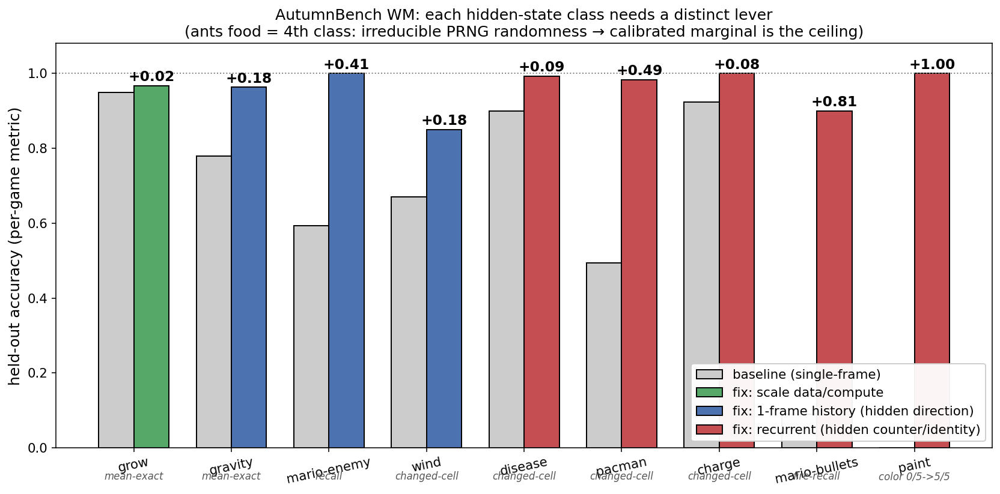
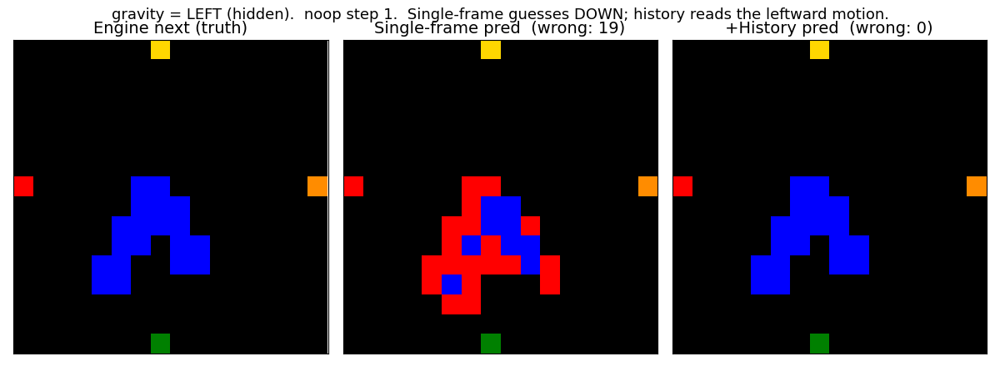
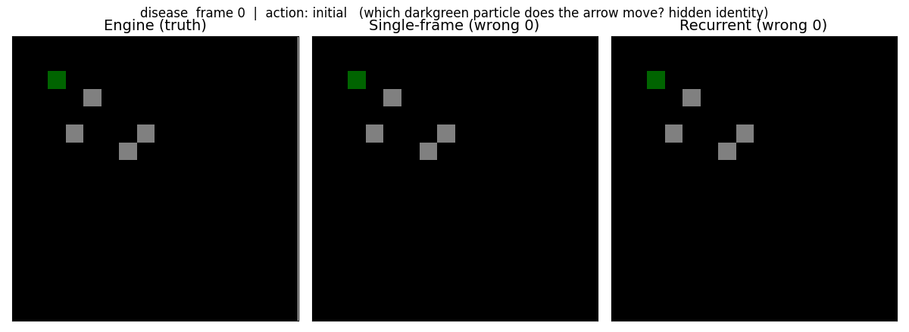
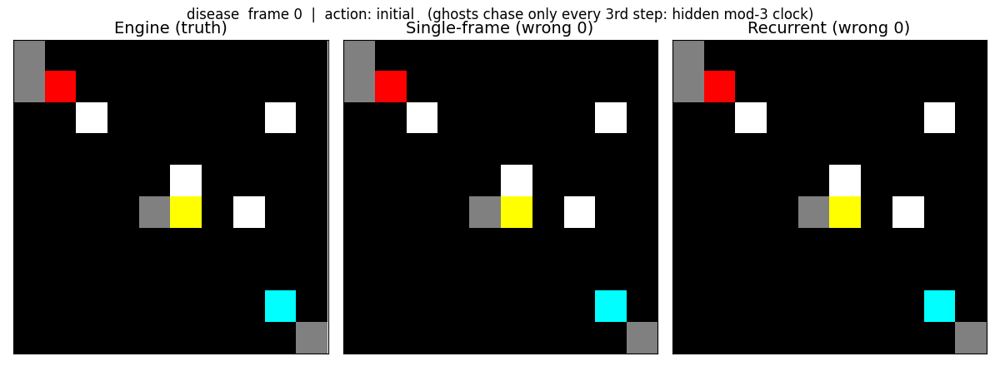
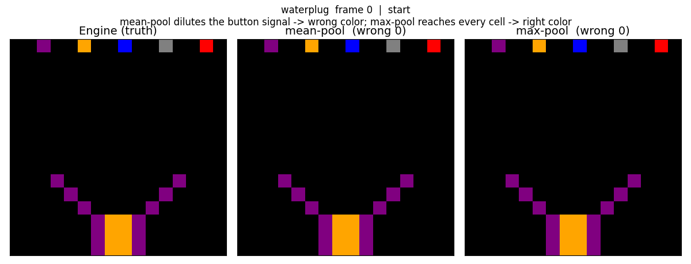
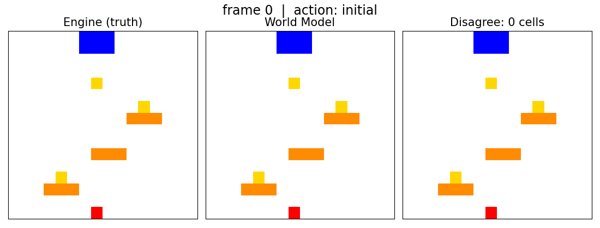
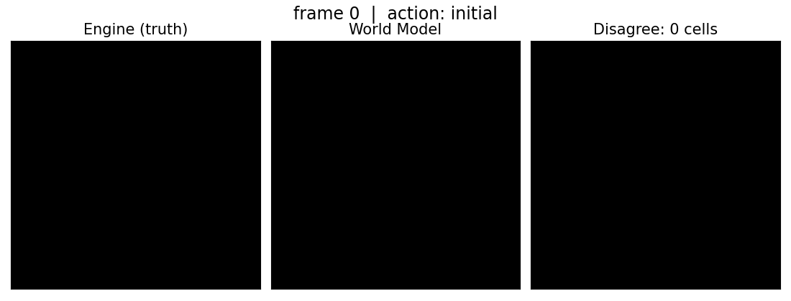
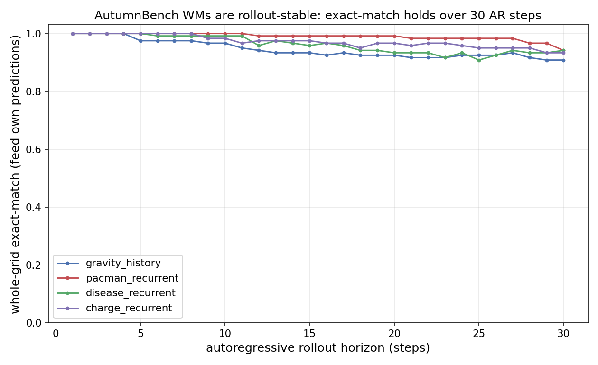

# Autumn NCA World Models

Single-game NCA world models for [AutumnBench](../../../mara/MARA/domains/autumnbench)
programs, using a discrete **color-grid** representation. Self-contained PyTorch
module (separate from the JAX PuzzleScript pipeline) because Autumn needs a
spatial `click(x,y)` action and all the I/O — collection, serving, GIFs — is new.

## Representation
- **State**: per-cell color index over a fixed per-game palette (discovered at
  collection time; background `black` = 0). GoL palette: `[black, lightpink, green, silver]`.
- **Action**: `noop` or `click(x,y)`. Encoded for the model as a 1-channel
  click-location map (1.0 at the clicked cell, all-zero for noop). The model
  must learn what each location does (e.g. the corner `buttonNext` cell triggers
  a global Game-of-Life update; `buttonReset` clears; other cells set a cell alive).

## Pipeline
```bash
# 1. Collect transitions via randomized deduped exploration (engine = oracle)
python -m nca_wm.autumn.collect --game gameOfLife --rollouts 300 --rollout_len 200 \
    --out nca_wm/autumn/data/gameOfLife.npz

# 2. Train (reports per-action-bucket metrics: noop/place/buttonNext/buttonReset)
python -m nca_wm.autumn.train --data nca_wm/autumn/data/gameOfLife.npz \
    --save_dir nca_wm/autumn/runs/gameOfLife --updates 8000

# 3. Side-by-side engine-vs-WM GIF
python -m nca_wm.autumn.render_gif --save_dir nca_wm/autumn/runs/gameOfLife --demo glider

# 4. Interactive side-by-side server with a model dropdown (port-forward to view)
python -m nca_wm.autumn.serve_compare --runs_dir nca_wm/autumn/runs --port 8766
```
All commands need `PYTHONPATH=/home/jupyter-smearle/mara/MARA` so the
`mara-autumn-cpp` interpreter import resolves, and the project `.venv`.

## Results — what limits each environment, and the lever that fixes it

Full write-up in **`FINDINGS.md`**; running detail in `WORKLOG.md`. The central
result: AutumnBench WMs fail in four distinct ways, each needing a different fix.
The diagnostic is the **noop-imperfect signature** — on a *deterministic* game,
`noop` whole-grid exact < ~0.95 means a hidden variable drives the autonomous
dynamics — plus the per-action breakdown (which action exposes the error).

| limiting factor | diagnostic | lever | environments (held-out before → after) |
|---|---|---|---|
| Markovian, just hard/under-data'd | noop≈1, scales | more data/compute | grow 0.95→0.97; lights/magnets/coins/chomp/lock/egg 0.92–1.00 |
| long-range propagation | noop imperfect, deeper helps | NCA **depth/capacity** | waterplug 0.895→0.972 (n_hid 256, n_steps 20) |
| hidden direction (acts every step) | noop imperfect, motion-readable | **1-frame history** | gravity 0.78→0.96, mario-enemy 0.59→1.00, wind 0.67→0.85 |
| hidden counter/identity (acts under specific actions) | noop perfect, fails under those actions | **recurrent hidden grid** | pacman 0.49→0.98, charge 0.92→1.00, disease 0.90→0.99, mario-bullets 0.09→0.90, paint 0/5→5/5 |
| irreducible randomness (seeded PRNG) | residual is an unpredictable draw | read the **calibrated marginal** | ants food (at its ceiling) |

Two negative controls pin the diagnostic down: more NCA steps do **not** help
gravity (its residual is hidden state, not propagation), and recurrent does **not**
help waterplug (its hidden mode drives too few transitions). Depth fixes
propagation; memory fixes hidden state — match the lever to the *cause*.

The models are genuine world models, not one-step predictors: fed their own
predictions for 30 steps, whole-grid exact-match stays ≥0.91 with cell-accuracy
≈1.0 (`figures/rollout_stability.{png,pdf}`).

Figures: `figures/taxonomy_levers.*` (the lever framework), `figures/rollout_stability.*`,
blindspot GIFs `figures/{gravity,disease,pacman}_blindspot.gif`. All trained models
are selectable in the `serve_compare` dropdown.

## Visualizations

Each environment's residual is a *kind of hidden state*, and each needs a distinct
architectural lever. The summary:



The GIFs below are **engine vs world-model, side by side** (red tints the cells where
they disagree). Each shows a blindspot and the lever that turns it off.

**Hidden direction → 1-frame history.** A single frame can't tell which way gravity
points (set by edge buttons, invisible in the grid), so it guesses "down" and is wrong
on 6/6 frames; history reads the blobs' motion and is perfect.



**Hidden counter/identity → recurrent hidden grid.** In disease, arrows move "the
active particle", but once the disease spreads you can't tell *which* darkgreen cell is
active from one frame — the single-frame model is wrong on 37/61 steps, the recurrent
model 0/61.



In pacman the ghosts chase only when `timestep % 3 == 0` — a hidden period-3 clock. The
single-frame model can't place itself in the cycle (41/61 wrong); the recurrent model
tracks the clock (4/61).



**Spatial-locality mode → max pooling.** Waterplug's mode buttons set what a click
places (vessel/plug/water), but pressing a corner button changes no visible cell. With
mean pooling the one-cell signal is diluted ~100× and never reaches the placement cell
(11/13 wrong — it places the default color); max pooling broadcasts it undiluted (0/13).



**Mario — all blindspots at once.** Enemy patrol direction (history) + bullet counter
(recurrent) + Mario-under-coin overlap (object channels):




**Paint — hidden `currColor` cycle (recurrent).** Single-frame can't track the 5-cycle
brush color; recurrent does:




**World-model quality:** fed their own predictions for 30 steps, the models barely
drift (whole-grid exact-match ≥0.91, cell-accuracy ≈1.0):



More GIFs in `figures/`: `mario_singleframe_patrol` (the blindspot before the fix),
`mario_recurrent_fire`, `sand_drop`, `gameOfLife_glider`, `got_clust_*`. Other summary
figures: `scaling_reducible.*` (data/compute helps reducible error, not irreducible),
`blindspot_taxonomy.*`, `overlap_fix.png`, `aleatoric_foodmap.png`.

## Model (`model.py`)
Shared-weight conv NCA: embed → `n_steps` × (3×3 perception + global-pool summary
→ residual update) → per-cell color logits, with a learnable copy-skip from the
input one-hot so "keep the current color" is the default. Global pooling lets a
single click anywhere drive a board-wide update (the `buttonNext` GoL trigger).

## Notes / gotchas
- Engine protocol: one transition = input method (`click`/`left`/…) **then** `step()`.
  Only the last-registered input applies per frame.
- GoL has no autonomous dynamics (all rules are click-triggered), so noop = identity
  and any state is reproducible by reset + replaying its click path.
- Collection seeds **clustered** placements so local neighborhoods span 0..8 live
  neighbors — uniform-random seeding almost never produces the "exactly 3 → birth" case.
